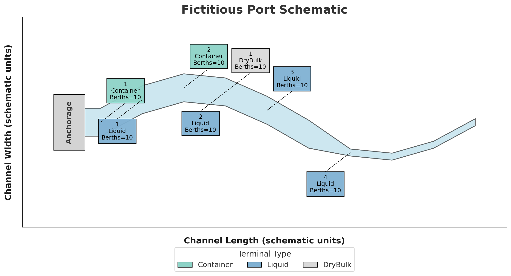

# Data-Driven, Multimodal Freight Simulation Framework for Waterways and Ports

<p align="center">
  
</p>


> **Note:** This is a **public v0.1 Beta release**. The framework is still under testing and active development, but it is functional and usable. Please report any issues through the [GitHub Issue Tracker](https://github.com/spartalab/port-simulation/issues).


This repository provides a modular, discrete-event simulation (DES) framework for analyzing multimodal port operations across container, liquid bulk, and dry bulk terminals. It is designed to support **planning, bottleneck detection, and what-if scenario analysis** using real-world data inputs and calibration.  

The simulation framework is developed for ports configured with an **anchorage area** connected to a **navigation channel** providing access to **terminals** and **landside transportation** modes. Input data for a hypothetical generic port system (shown above) are provided as an illustrative example. Users can adjust input parameters and the port layout configuration to simulate real-world port operations and scenarios for their desired location.  

[](https://github.com/spartalab/port-simulation/raw/main/simulation_documentation/Simulation_Manual.pdf)


Currently, the model supports:  

- **Vessel types:** Container, tanker (liquid bulk), and dry bulk vessels  
- **Landside connections:** Truck, rail, and pipeline system interconnections  

---

## Contents

- [Purpose](#purpose)
- [Documentation](#documentation)
- [Inputs: Required data and file specifications](#inputs-required-data-and-file-specifications)
- [Quick start](#quick-start)
- [Project structure](#project-structure)
- [Simulation modules](#simulation-modules-defined-in-simulation_classes-folder)
- [Contributors and acknowledgments](#contributors-and-acknowledgments)  
- [Copyright and license](#copyright-and-license)  

---

## Purpose

This model aids port planners and waterway management agencies in:

- Identifying system bottlenecks
- Analyzing vessel and cargo throughput
- Evaluating port performance under disruption
- Conducting what-if analyses

---

## Documentation

**Code documentation:**  
Detailed documentation for each script is provided in HTML format in the `documentation` folder.  To open the documentation, download the folder and open `index.html` in a browser. The same documentation is also hosted [here.](https://spartalab.github.io/port-simulation/)

**Simulation manual (PDF):**  
A PDF Simulation Manual is also available, containing details on input data and example outputs.  Please review the manual to understand the scope of the simulation. [Download the simulation manual.](https://github.com/spartalab/port-simulation/raw/main/simulation_documentation/Simulation_Manual.pdf)


---

## Inputs: Required data and file specifications

The simulation requires several input files that define the **navigation channel**, **vessel classes**, and **terminal resources**. These inputs must be prepared carefully for any new port to ensure realistic results. 

### Summary Checklist
Before running a new port simulation, prepare:

**Channel geometry:** divide the channel into sections where terminals are located. Each section has particular lengths, widths, depths, and travel speeds. The current synthetic data is given for 10 sections. Each section can have multiple terminals but the simulation will treat each of these terminals as being located at the exact same place. 

**Vessel traffic mix:** vessel dimensions, payload, and tug and pilot requirements for vessels. The provided data assumes vessels are one of three size types (small, medium, or large) for the container, liquid, and dry bulk cargo classes.

**Terminal resources:** berth counts, cranes/pipelines/conveyors and their associated transfer rates.  

**Landside:** truck and train arrival rates, gates, storage, payloads, and terminals which have these connections.

**Activity flags:** if a terminal is import/export-only or allows both, pipeline connectivity.  

Only after these files are updated should you run the simulation. **Synthetic data for a generic port with 10 channel sections, 2 container terminals, 4 liquid bulk terminals, and 1 dry bulk terminal have been provided.**

⚠️ **Important:** Only edit the base user files listed below. Internal copies (e.g., `constants.py`, `terminal_data.csv`) are automatically generated by the simulation and should **not** be changed manually.

### 1. `config.py`
Sets global parameters for a simulation run (duration, seeds, scenario name, number of cores, restriction toggles, etc.) and port details. Vessel arrival rates (Poisson), number of pilots and tugboats are also set here. 

### 2. `inputs/channel_dimensions.csv`
Defines the navigation channel as segments used for movement and restriction checks.

### 3. `inputs/ship_sizes.csv`
Defines representative vessel classes by cargo type with geometry, tonnage, and tug/pilot needs.  

### 4. `inputs/terminal_data_base.csv`
Defines resources and landside throughput at each terminal. Copied internally to `terminal_data.csv`.  Any value may be randomly sampled from range (a,b) instead of providing a single value.

---

## Quick start

### 1. Install requirements

```bash
pip install -r requirements.txt
```

We recommend using a virtual environment (`venv` or `pipenv`) to install all packages and dependencies in a clean workspace.

### 2. Run the simulation

**2.1 Base simulation** Runs the base simulation.
Edit `config.py` to configure your simulation scenario. Then:

```bash
python main.py
```

Output plots and logs are saved in the appropriate folders. The current version supports parallel processing and the number of cores can be set in the `config.py` file.


**2.2 Bottleneck detection** Runs sensitivity analysis on all resources one by one.
Edit `config.py` to configure your simulation scenario. Set `SCENARIO_NAME = "BottleneckDetection"` Then:

```bash
python bottleneck_analysis.py
```

Output plots and logs are saved in the `bottleneckAnalysis` folder. Each sensitivity analysis is saved as different folders under `bottleneckAnalysis`. Key metrics of each sensitivity analysis are saved in  `bottleneckAnalysis/logs` folder.  A summary is saved in `bottleneckAnalysis/results.txt` and  `bottleneckAnalysis/capacity_analysis.csv`. The current version supports parallel processing and the number of cores can be set in the `config.py` file. Note: runtime may be very long, on the order of 1-2 days, depending on computing resources.


**2.3 Capacity analysis** Runs several simulations with varied arrival rates to determine the "breakpoint" of the system.
Edit `config.py` to configure your simulation scenario. Set `SCENARIO_NAME = "BreakpointAnalysis"` Then:

```bash
python breakpoint_analysis.py
```

Output plots and logs are saved in the `breakpointAnalysis` folder. The current version supports parallel processing and the number of cores can be set in the `config.py` file.

**⚠️ Important:**

The `terminal_data.csv` and `constants.csv` are automatically changed in the code while scenario analyses are performed. For every scenario, the `config.py` and `terminal_data_base.csv` are copied to `constants.py` and `terminal_data.csv` respectively. This allows for some resource availabilities to be dynamically increased or decreased for a given scenario.

---

## Project structure

```
.
├── main.py                                        # Master simulation controller
├── breakpoint_analysis.py                         # Finds break-points with varying arrival rates
├── bottleneck_analysis.py                         # Finds resource bottlenecks
|
├── config.py                                      # Set input parameters for the simulation
├── constants.py                                   # Internal config for simulation (DO NOT CHANGE)
|
├── inputs/                                        # Input datasets for terminals and channels
│   ├── channel_dimensions.csv                     # Channel dimensions
│   ├── ship_sizes.csv                             # Vessel dimensions
│   └── terminal_data_base.csv                     # Terminal attributes (Changes should be made only here)
│   └── terminal_data.csv                          # Internal copy (DO NOT CHANGE)
|
├── simulation_analysis/                           # Post-processing & results analytics
│   ├── capacity.py                                # Functions that estimate operating & ultimate capacity
│   ├── collate_results.py                         # Aggregates results across runs
│   ├── resource_utilization.py                    # Computes berth / crane / pipeline utilizations
│   ├── results.py                                 # Generates plots and logs for every seed
│   └── whatif_scenarios.py                        # Models “what-if” scenarios and sensitivity tests
│
├── simulation_classes/                            # Core SimPy entity classes
│   ├── channel.py                                 # Navigational channel processes
│   ├── pipeline.py                                # Pipeline resource model for liquid cargo
│   ├── port.py                                    # Port resources for all terminals, pilots and tugboats
│   ├── terminal_container.py                      # Container-terminal operations logic
│   ├── terminal_drybulk.py                        # Dry-bulk-terminal operations logic
│   ├── terminal_liquid.py                         # Liquid-bulk-terminal operations logic
│   ├── train.py                                   # Rail interface (loading / unloading trains)
│   └── truck.py                                   # Gate-truck processes (arrivals, dwell, exit)
│
├── simulation_handler/                            # Utilities that prepare and launch runs
│   ├── generators.py                              # Arrival-stream & demand generators for simpy classes
│   ├── helpers.py                                 # Shared helper functions 
│   ├── preprocess.py                              # Cleans and validates inputs; writes derived tables
│   └── run_simulation.py                          # script to run the simulation
│
├── simulation_documentation/                      # Self-contained HTML docs built by pdoc
│   ├── generate_documentation                     # Bash / Python script that triggers pdoc build
│   └── home_logo.png                              # Logo for the project
│   └── *.html files                               # html files for documentation. Use index.html to navigate
|
├── .Results_<SEED>_<DURATION>_<VERSION>/          # Auto-generated per simulation seed 
│   ├── bottlenecks/                               # Bottleneck reports per run
│   ├── logs/                                      # Time-stamped operational logs
│   └── plots/                                     # Output plots (e.g., queue lengths, flow rates)
|
├──collatedResults/                                # Combined results for multi-seed runs
└── <DURATION>_months_<COUNT>_runs_run_<LOG_ID>/   # Seed-based run result collation
    ├── data/                                      # Combined CSV files across all seeds
    ├── distPlots/                                 # Plots showing time spent in each process
    ├── queuePlots/                                # Time series plots of queue lengths by cargo type
    ├── restrictionPlots/                          # Histograms showing wait times for channel restrictions
    ├── timePlots/                                 # Turnaround, dwell, and anchorage time distribution plots
    ├── capacity_simulation_analysis.pdf           # Summary of capacity estimates for each terminal type
    ├── channel.pdf                                # Time series of number of vessels in channel
    └── run_details_run_100.txt                    # Summary run report
|
├──bottleneckAnalysis/                             # Results for bottleneck analysis
|
├──breakpointAnalysis/                             # Results for capacity analysis
```

---

## Simulation modules (defined in `simulation_classes` folder)

### Terminals

Each terminal is modeled as a SimPy process with its own class, resources, and queue logic.

**ContainerTerminal (defined in `terminal_container.py`)**

- **Operations**: Berth and crane allocation, container transfer, yard storage
- **Resources**: Berths, cranes, yard
- **Classes**: `Container`, `Crane`, `Berth_Ctr` (These are defined in `Port.py`)

**LiquidTerminal (defined in `terminal_liquid.py`)**

- **Operations**: Berth allocation, pipeline cargo transfer, tank storage
- **Resources**: Pipelines, tanks, berths
- **Classes**: `LiquidBatch`, `Pipeline`, `Berth_Liq` (These are defined in `Port.py`)

**DryBulkTerminal (defined in `terminal_drybulk.py`)**

- **Operations**: Berth allocation, conveyor-based transfer, silo storage
- **Resources**: Conveyors, silos, berths
- **Classes**: `DryBulkBatch`, `Conveyor`, `Berth_DryBulk` (These are defined in `Port.py`)

### Inland transport

These modules handle the interaction between terminals and landside transport modes.

#### Truck (defined in `truck.py`)

**Operations**: Handles container, liquid, and dry bulk delivery/pickup via trucks

**Processes**: 
  - Truck arrival
  - Loading/unloading
  - Waiting for resource availability

#### Train (defined in `train.py`)

**Operations**: Models bulk transfer through trains (e.g., containers or bulk cargo)

**Processes**:
  - Train formation and arrival
  - Bulk transfer from terminal (liquid or dry bulk)
  - Departure after processing

#### Pipeline (defined in `pipeline.py`)

**Operations**: Facilitates liquid cargo transfer between terminal tanks and regional pipeline network (this is modeled as a source / sink to the pipeline network)

**Processes**:
  - Transfer as source or sink from terminal storage tanks based on pump rate
  - Starts and stops when certain tank volumes are met

### Channel navigation (via `channel.py`)

This module handles the vessel movement through port entry and exit channels. It tracks vessel navigation, applies movement rules, and can enforce access restrictions.

- **Two-way vessel traffic** is supported by default, allowing simultaneous inbound and outbound movements without conflict.
- **Restriction logic implemented**: The user can toggle constraints such as:
  - Beam, draft and daylight restrictions
  - Spacing rules between consecutive vessels

**Note:** To run the restricted channel with a different restriction just change the channel dimensions file in the inputs folder.


### Analysis modules (defined in `simulation_analysis` folder)

`whatif_scenarios.py`
This script works in conjunction with `main.py`; scenarios to be tested can be set in `config.py`.
Runs simulations under different scenarios (disruptions, parameter changes, etc). Useful for comparative assessments. It automates multiple simulation runs under varied configurations, allowing users to test hypotheses such as:

- How does port performance change under increased arrival rates?
- What if certain terminals or berths are unavailable due to disruptions?
- How sensitive is system throughput to changes in crane, pipeline, or conveyor efficiency?
- What effect does toggling channel restrictions have on congestion and vessel wait times?
- How does varying the number of simulation seeds affect statistical confidence in the results?

`capacity.py`
This script works in conjunction with `main.py`
Analytical module to estimate:
- **Operating Capacity**: Max throughput under stable conditions
- **Ultimate Capacity**: Saturation throughput under unstable queues

`resource_utilization.py`
This script works in conjunction with `main.py`
- Evaluates system resource utilization and restrictions

---

## Contributors and acknowledgments  

This project was developed by members of the [Simulation, Pricing, Autonomous Vehicles, Routing, & Traffic Assignment (SPARTA) Lab](https://github.com/spartalab) at The University of Texas at Austin.  

**Debojjal Bagchi**  
  - Ph.D. student, The University of Texas at Austin  
  - Email: debojjalb@utexas.edu  
  - Website: <https://debojjalb.github.io/>  

**Kyle Bathgate**  
  - Ph.D. candidate, The University of Texas at Austin  
  - Email: kyle.bathgate@utexas.edu  
  - Website: <https://kylebathgate.github.io/>  

We gratefully acknowledge the support of our advisor **Dr. Stephen Boyles** (sboyles@austin.utexas.edu) for his invaluable guidance throughout this project.  

This research was partially funded by the **U.S. Army Engineer Research and Development Center (ERDC)** under contract **#W912HZ23C0052**, *“Data-Driven, Multimodal Freight Modeling for Waterways and Ports.”* The findings and opinions expressed here are those of the authors and do not represent official policies or standards of the U.S. Army Corps of Engineers.  

This work was also partially supported by the **University Transportation Center (UTC) National Center for Understanding Future Travel Behavior and Demand (TBD)**.

We also thank **Dr. Kenneth N. Mitchell**, **Dr. Magdalena I. Asborno**, **Dr. Marin M. Kress**, and **Mr. Mark A. Cowan** of ERDC for their valuable input and feedback that greatly improved this work.  

### Contributing

We welcome all suggestions from the community. If you wish to contribute or report any bug please contact the creaters or create an issue on [issue tracking system](https://github.com/spartalab/port-simulation/issues).

---


## Copyright and license

The content of this repository is bounded by MIT License. See [LICENSE](https://github.com/spartalab/port-simulation/blob/main/LICENSE) file for details.
