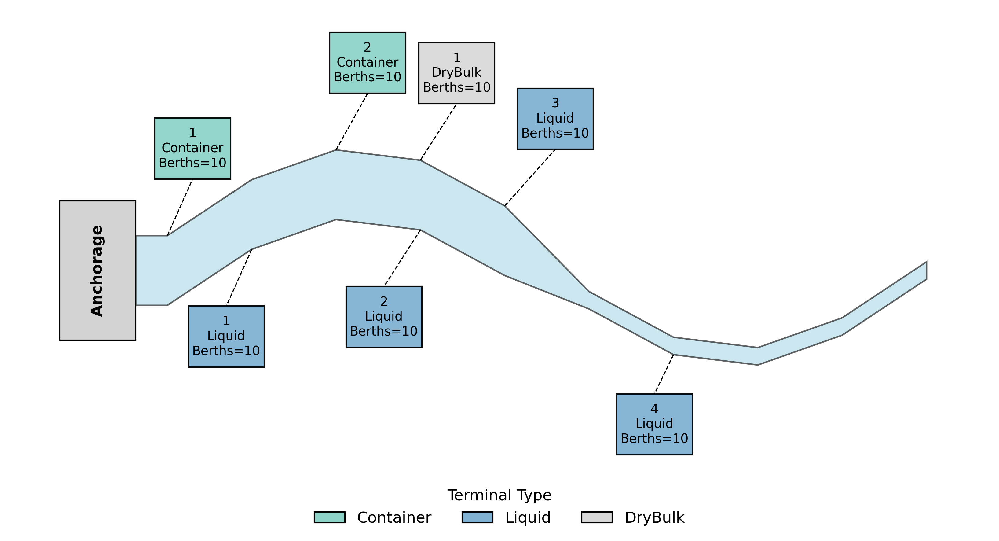

# Data-Driven, Multimodal Freight Simulation Framework for Waterways and Ports

<p align="center">
  
</p>

This repository provides a modular, discrete-event simulation (DES) framework for analyzing multimodal port operations across container, liquid bulk, and dry bulk terminals. It is designed to support **planning, bottleneck detection, and what-if scenario analysis** using real-world data inputs and calibration.  

The simulation framework is developed for ports configured with an **anchorage area** connected to a **navigation channel** providing access to **terminals** and **landside transportation** modes. Input data for a hypothetical generic port system (shown above) are provided as an illustrative example. Users can adjust input parameters and the port layout configuration to simulate real-world port operations and scenarios for their desired location.  

[](https://github.com/spartalab/port-simulation/raw/main/simulation_documentation/Simulation_Manual.pdf)


Currently, the model supports:  

- **Vessel types:** Container, tanker (liquid bulk), and dry bulk vessels  
- **Landside connections:** Truck, rail, and pipeline system interconnections  

---

## Purpose

This model aids port planners and waterway management agencies in:
- Identifying system bottlenecks
- Analyzing vessel and cargo throughput
- Evaluating port performance under disruption
- Conducting what-if analyses

---

## Documentation

Detailed documentation for each script is given in html format in the documentation folder. To open html documentation files, download the documentation folder and open `index.html` in a browser.

---
## Inputs: Required Data and File Specifications

The simulation requires several input files that define the **navigation channel**, **vessel classes**, and **terminal resources**. These inputs must be prepared carefully for any new port to ensure realistic results. This section describes each file, the meaning of its columns, expected units, and guidance on how to obtain the data.  

### Summary Checklist
Before running a new port simulation, prepare:
- Channel geometry: divide the channel into section where terminals are located. Each section has particular lengths, widths, depths, and travel speeds. The current generic data is given for 10 sections. Each section can have multiple terminals but the simulation will treat each of these terminals as being located at the exact same place. 
- Vessel traffic mix: vessel dimensions, payload, and tug and pilot requirements for vessels. The provided data assumes vessels are one of three size types (small, medium, or large) for the container, liquid, and dry bulk cargo classes.
- Terminal resources: berth counts, cranes/pipelines/conveyors and their associated transfer rates.  
- Landside: truck and train arrival rates, gates, storage, payloads, and terminals which have these connections.
- Activity flags: if a terminal is import/export-only or allows both, pipeline connectivity.  

Only after these files are updated should you run the simulation. **Synthetic data for a generic port with 10 channel sections, 2 container terminals, 4 liquid bulk terminals, and 1 dry bulk terminal have been provided.**

⚠️ **Important:** Only edit the base user files listed below. Internal copies (e.g., `constants.py`, `terminal_data.csv`) are automatically generated by the simulation and should **not** be changed manually.

### 1. `config.py`
- **Purpose:** Sets global parameters for a simulation run (duration, seeds, scenario name, number of cores, restriction toggles, etc.) and port details. Vessel arrival rates (Poisson), number of pilots and tugboats are set here. 
- **Data required:**  
  - **Simulation setup:** simulation horizon (months), number of random seeds and replications, run identifiers and scenario name (e.g., Base, Bottleneck Detection, Breakpoint Analysis), number of CPU cores for parallel processing, logging and output options.  
  - **Channel and navigation restrictions:** two-way or one-way channel traffic, daylight navigation rules, draft limits, beam limits.  
  - **Port-wide resources:** number of pilots available, number of tugboats available.  
  - **Vessel arrivals:** arrival rates for container vessels, liquid bulk tankers, and dry bulk/general cargo vessels (modeled as Poisson processes).  
  - **Operational performance parameters:** average anchorage waiting times by cargo type, efficiency multipliers for container, liquid, and dry bulk terminals.  
  - **Conversion factors:** TEU to tons, barrels to tons (for liquid bulk).  

- **Units:** simulation duration in months; all time-related variables in hours; vessel arrival rates in ships/hour; anchorage waiting times in hours; efficiency multipliers are dimensionless; conversion factors in tons/TEU and tons/barrel.  

### 2. `inputs/channel_dimensions.csv`
- **Purpose:** Defines the navigation channel as segments used for movement and restriction checks.
- **Columns:**
  - `SectionID` — Unique segment identifier (integer).  
  - `length (miles)` — Segment length [mile].  
  - `width (ft)` — Navigable width [ft].  
  - `depth (ft)` — Controlling depth [ft].  
  - `speed (mph)` — Typical segment travel speed [mph].  

- **How to obtain:** AIS data analysis or port records. Replace with actual approach, entrance, and segments for a given port layout. Adjust channel widths, depths, and travel speeds or speed limits as per local pilotage rules.  

### 3. `inputs/ship_sizes.csv`
- **Purpose:** Defines representative vessel classes by cargo type with geometry, tonnage, and tug/pilot needs.  
- **Columns:**
  - `ship_type` — Cargo type (`Container`, `DryBulk`, `Liquid`).  
  - `Size` — Class label (Small/Medium/Large).  
  - `Avg_Length`, `Std_Length` — Vessel LOA [ft].  
  - `Avg_Beam`, `Std_Beam` — Beam [ft].  
  - `Avg_Draft`, `Std_Draft` — Draft [ft].  
  - `Avg_Tonnage`, `Std_Tonnage` — Tonnage [ton].  
  - `Count`, `Fraction` — Share of class within type.  
  - `min_pilots`, `max_pilots` — Pilot requirement [count].  
  - `min_tugs`, `max_tugs` — Tug requirement [count].  

- **How to obtain:** AIS data, port call logs, pilot transit data, or similar. Clustering of obtained data is recommended for obtaining small/medium/large distinction. Update vessel class definitions, dimensions, tonnages, shares, and tug/pilot rules.  

### 4. `inputs/terminal_data_base.csv`
- **Purpose:** Defines resources and landside throughput at each terminal. Copied internally to `terminal_data.csv`.  Any value may be randomly sampled from range (a,b) instead of providing a unique value. Data is sampled from a uniform distribution in range (a,b). 
- **Columns:**
  - `Cargo` — Cargo type (`Container`, `Liquid`, `DryBulk`).  
  - `Terminal` — Terminal identifier.  
  - `Segment` — Linked channel `SectionID` in `inputs/channel_dimensions.csv`, gives location of terminal in channel.
  - `Berths` — Number of berths.  
  - `import`, `export` — Import/export enabled (0/1).  
  - `storage volume` — TEU for container, tons for dry bulk, and CBM for liquid.  
  - `transfer units per berth` — Cranes/pipelines/conveyors [count].  
  - `transfer rate per unit` — Moves/hour (container), tons/hour (dry bulk), or CBM/hour (liquid).  
  - `truck arrival rate` — Trucks/hour.  
  - `truck gates`, `truck bays/chassis` — Gate lanes and bays [count].  
  - `truck loading/unloading rate` — Service rate [per hour].  
  - `truck payload size` — FEU/TEU or tons per truck.  
  - `train arrival rate` — Trains/hour.  
  - `train car storage`, `train car loading bays` — Rail resources [count].  
  - `train cargo transfer rate` — Transfer rate [per hour].  
  - `train car payload size` — TEU, tons, or CBM per car.  
  - `pipeline source`, `pipeline sink` — Flags for import/export via pipeline (0/1).  
  - `train car amount` — Cars per train.  
- **How to obtain:** Terminal operator reports, port authority plans, and operator interviews. Replace with actual terminal infrastructure, handling gear, and landside throughput data.  


---

## Quick Start

### 1. Install Requirements

```bash
pip install -r requirements.txt
```

We recommend using a virtual environment (`venv` or `pipenv`) to install all packages and dependencies in a clean workspace.

### 2. Run the Simulation

**2.1 Base simulation** Runs the base simulation.
Edit `config.py` to configure your simulation scenario. Then:

```bash
python main.py
```

Output plots and logs are saved in the appropriate folders. The current version supports parallel processing and the number of cores can be set in the `config.py` file.


**2.2 Bottleneck detection** Runs sensitivity analysis on all resources one by one.
Edit `config.py` to configure your simulation scenario. Set `SCENARIO_NAME = "BottleneckDetection"` Then:

```bash
cd simulation_analysis
python bottleneck_analysis.py
```

Output plots and logs are saved in the `bottleneckAnalysis` folder. Each sensitivity analysis is saved as different folders under `bottleneckAnalysis`. Key metrics of each sensitivity analysis is saved in  `bottleneckAnalysis/logs` folder.  A summary is saved in `bottleneckAnalysis/results.txt` and  `bottleneckAnalysis/capacity_analysis.csv`. The current version supports parallel processing and the number of cores can be set in the `config.py` file. Note: runtime may be very long, on the order of 1-2 days, depending on computing resources.


**2.3 Capacity analysis** Runs several simulations with varied arrival rates to determine the "breakpoint" of the system.
Edit `config.py` to configure your simulation scenario. Set `SCENARIO_NAME = "BreakpointAnalysis"` Then:

```bash
python breakpoint_analysis.py
```

Output plots and logs are saved in the `breakpointAnalysis` folder. The current version supports parallel processing and the number of cores can be set in the `config.py` file.

**⚠️ Important:**
The following simulation input paramaters can be changed:
- `config.py` (`constants.py` is an internal copy of `config.py` which should NOT be changed. The code automatically copies the values in `config.py` to `constants.py` when required, such as in the breakpoint analysis)
- `inputs/terminal_data_base.csv` (do not change `terminal_data` directly, these values are automatically copied over from the base file.)
- `inputs/channel_dimensions.csv`
- `inputs/ship_sizes.csv`

The `terminal_data.csv` and `constants.csv` are automatically changed in the code while sceario analyses are performed. For every scenario, the `config.py` and `terminal_data_base.py` are copied to `constants.py` and `terminal_data.csv` respectively. This allows for some resource availabilities to be dynamically increased or decreased for a given scenario.

---

## Project Structure

```
.
├── main.py                                        # Master simulation controller
├── breakpoint_analysis.py                                  # Finds break-points with varying arrival rates
├── bottleneck_analysis.py                         # Finds resource bottlenecks
|
├── config.py                                      # Set input parameters for the simulation
├── constants.py                                   # Internal config for simulation (DO NOT CHANGE)
|
├── inputs/                                        # Input datasets for terminals and channels
│   ├── channel_dimensions.csv                     # Channel dimensions
│   ├── ship_sizes.csv                             # Vessel dimensions
│   └── terminal_data_base.csv                     # Terminal attributes (Changes should be made only here)
│   └── terminal_data.csv                          # Internal copy (DO NOT CHANGE)
|
├── simulation_analysis/                           # Post-processing & results analytics
│   ├── capacity.py                                # Functions that estimate operating & ultimate capacity
│   ├── collate_results.py                         # Aggregates results across runs
│   ├── resource_utilization.py                    # Computes berth / crane / pipeline utilizations
│   ├── results.py                                 # Generates plots and logs for every seed
│   └── whatif_scenarios.py                        # Models “what-if” scenarios and sensitivity tests
│
├── simulation_classes/                            # Core SimPy entity classes
│   ├── channel.py                                 # Navigational channel processes
│   ├── pipeline.py                                # Pipeline resource model for liquid cargo
│   ├── port.py                                    # Port resources for all terminals, pilots and tugboats
│   ├── terminal_container.py                      # Container-terminal operations logic
│   ├── terminal_drybulk.py                        # Dry-bulk-terminal operations logic
│   ├── terminal_liquid.py                         # Liquid-bulk-terminal operations logic
│   ├── train.py                                   # Rail interface (loading / unloading trains)
│   └── truck.py                                   # Gate-truck processes (arrivals, dwell, exit)
│
├── simulation_handler/                            # Utilities that prepare and launch runs
│   ├── generators.py                              # Arrival-stream & demand generators for simpy classes
│   ├── helpers.py                                 # Shared helper functions 
│   ├── preprocess.py                              # Cleans and validates inputs; writes derived tables
│   └── run_simulation.py                          # script to run the simulation
│
├── simulation_documentation/                      # Self-contained HTML docs built by pdoc
│   ├── generate_documentation                     # Bash / Python script that triggers pdoc build
│   └── home_logo.png                              # Logo for the project
│   └── *.html files                               # html files for documentation. Use index.html to navigate
|
├── .Results_<SEED>_<DURATION>_<VERSION>/          # Auto-generated per simulation seed 
│   ├── bottlenecks/                               # Bottleneck reports per run
│   ├── logs/                                      # Time-stamped operational logs
│   └── plots/                                     # Output plots (e.g., queue lengths, flow rates)
|
├──collatedResults/                                # Combined results for multi-seed runs
└── <DURATION>_months_<COUNT>_runs_run_<LOG_ID>/   # Seed-based run result collation
    ├── data/                                      # Combined CSV files across all seeds
    ├── distPlots/                                 # Plots showing time spent in each process
    ├── queuePlots/                                # Time series plots of queue lengths by cargo type
    ├── restrictionPlots/                          # Histograms showing wait times for channel restrictions
    ├── timePlots/                                 # Turnaround, dwell, and anchorage time distribution plots
    ├── capacity_simulation_analysis.pdf           # Summary of capacity estimates for each terminal type
    ├── channel.pdf                                # Time series of number of vessels in channel
    └── run_details_run_100.txt                    # Summary run report
|
├──bottleneckAnalysis/                             # Results for bottleneck analysis
|
├──breakpointAnalysis/                             # Results for capacity analysis
```

---

## 4. Output Organization

### `.Results_<SEED>_<DURATION>_<VERSION>/`

For each individual simulation seed (as defined in `constants.py`), a directory is created with the naming pattern `.Results_<seed>_<duration>_<version>/` (e.g., `.Results_1000_6_months_1.0`). It contains:

- `bottlenecks/`: Text/CSV-based summaries of system bottlenecks (e.g., resource utilizations)
- `logs/`: Raw logs of simulation events, timestamps, vessel arrivals/departures, and resource allocation events
- `plots/`: Organized subplots and visual summaries of port performance metrics, including:

**Subfolders within `plots/`:**

  - `DwellTimes/`, `TurnTimes/`: Time series plots showing individual ship dwell and turnaround times over the simulation 
  - `DwellTimesDist/`, `TurnTimesDist/`: Histograms of ship dwell and turnaround times
  - `shipDistribution/`, `truckDistribution/`: Breakdown of vessel or truck types by terminal and cargo type
  - `TruckArrival/`, `TruckDwell/`: Truck-specific plots including arrival times, dwell durations
  - `TerminalProcessCharts/`: Plots of ship processing times (e.g., time of unloading/loading) per terminal
  - `TerminalProcessDist/`: Distributions of time spent in terminal processes to examine terminal efficiency
  - `scenarios/`: Arrival pattern plots if arrival patterns change in specific scenarios 

**Individual files in `plots/`:**

  - `dwell_time_distribution.jpg`, `turn_time_distribution.jpg`: Summary distributions for quick viewing
  - `anchorage_queue_all.pdf`: Combined queue length across all cargo types
  - `anchorage_queue_Container.pdf`, `DryBulk.pdf`, `Liquid.pdf`: Anchorage queue trends by cargo type
  - `channel_utilization.pdf`: Time-varying utilization of the channel
  - `ChannelSections.pdf`: Schematic of channel segments used in the simulation
  - `DayPilots.pdf`, `NightPilots.pdf`: Availability of pilots for vessel navigation by night and day hours
  - `Tugboats.pdf`: Plot summaries of tug availability
  - `moves.pdf`: Plot summaries of crane movements in container terminals

This structure helps organize detailed visual diagnostics for each run and allows users to identify specific system behaviors (e.g., high dwell times for dry bulk vessels, channel congestion periods, etc.).


### `collatedResults/`

After all seeds are completed, results are merged into `collatedResults/`. Each subfolder represents a combined output for a specific configuration of run duration and number of seeds.

Example: `collatedResults/6_months_2_runs_run_100/` contains:

- `data/`: Combined CSV datasets across runs (queue logs, time logs, throughput)
- `distPlots/`: Combined distributions (e.g., dwell, turn, and queue histograms)
- `queuePlots/`: Mean of queue lengths across all simulation seeds
- `restrictionPlots/`: Plots that show time consumed by navigation restrictions
- `timePlots/`: Aggregated dwell, turn, and service time graphs
- `capacity_simulation_analysis.pdf`: Overall capacity metrics derived from the simulation
- `channel.pdf`: Summary visualization of channel usage
- `run_details_run_100.txt`: Summary of results across all seeds

---

## 5. Simulation Modules (defined in `simulation_classes` folder)

### Terminals

Each terminal is modeled as a SimPy process with its own class, resources, and queue logic.

#### ContainerTerminal (defined in `terminal_container.py`)
- **Operations**: Berth and crane allocation, container transfer, yard storage
- **Resources**: Berths, cranes, yard
- **Classes**: `Container`, `Crane`, `Berth_Ctr` (These are defined in `Port.py`)

#### LiquidTerminal (defined in `terminal_liquid.py`)
- **Operations**: Berth allocation, pipeline cargo transfer, tank storage
- **Resources**: Pipelines, tanks, berths
- **Classes**: `LiquidBatch`, `Pipeline`, `Berth_Liq` (These are defined in `Port.py`)

#### DryBulkTerminal (defined in `terminal_drybulk.py`)
- **Operations**: Berth allocation, Conveyor-based transfer, silo storage
- **Resources**: Conveyors, silos, berths
- **Classes**: `DryBulkBatch`, `Conveyor`, `Berth_DryBulk` (These are defined in `Port.py`)

### Inland Transport

These modules handle the interaction between terminals and land-side transport modes.

#### Truck (defined in `truck.py`)
- **Operations**: Handles container, liquid, and dry bulk delivery/pickup via trucks
- **Processes**: 
  - Truck arrival
  - Loading/unloading
  - Waiting for resource availability
- **Class**: `Truck` — represents each truck with relevant cargo information and terminal linkage

#### Train (defined in `train.py`)
- **Operations**: Models bulk transfer through trains (e.g., containers or bulk cargo)
- **Processes**:
  - Train formation and arrival
  - Bulk transfer from terminal (liquid or dry bulk)
  - Departure after processing
- **Class**: `Train` — defines train-level scheduling, interaction with terminals

#### Pipeline (defined in `pipeline.py`)
- **Operations**: Facilitates liquid cargo transfer between terminal tanks and regional pipeline network (this is modelled as a source / sink to the pipeline network)
- **Processes**:
  - Transfer as source or sink from terminal storage tanks based on pump rate
  - Starts and stops when certain tank volumes are met
- **Class**: `Pipeline` — models tank, mode (source or sink), and pump rate

### Channel Navigation (via `channel.py`)

This module handles the vessel movement through port entry and exit channels. It tracks vessel navigation, applies movement rules, and can enforce access restrictions.

- **Two-way vessel traffic** is supported by default, allowing simultaneous inbound and outbound movements without conflict.
- **Restriction logic implemented**: The user can toggle constraints such as:
  - Beam, draft and daylight restrictions
  - One-way traffic (e.g., no restriction on beam, draft, daylight at all)
  - Spacing rules between consecutive vessels
- **Vessel entry/exit logging**: Every vessel’s time of channel entry and exit is recorded, allowing analysis of channel utilization and potential delays.

**Note:** To run the restricted channel with a different restriction just change the channel dimensions file under inputs folder.


### Analysis modules (defined in `simulation_analysis` folder)

### `whatif_simulation_analysis.py`
This script works in conjunction with `main.py`; scenarios to be tested can be set in `constants.py`.
Runs simulations under different scenarios (disruptions, parameter changes, etc). Useful for comparative assessments. It automates multiple simulation runs under varied configurations, allowing users to test hypotheses such as:

- How does port performance change under increased arrival rates?
- What if certain terminals or berths are unavailable due to disruptions?
- How sensitive is system throughput to changes in crane, pipeline, or conveyor efficiency?
- What effect does toggling channel restrictions have on congestion and vessel wait times?
- How does varying the number of simulation seeds affect statistical confidence in the results?

#### ⚠️ Important:
This script runs through `main.py`. However, more analysis can be performed by running this script seperately. 

```bash
python whatif_simulation_analysis.py
```

### `capacity.py`
This script works in conjunction with `main.py`
Analytical module to estimate:
- **Operating Capacity**: Max throughput under stable conditions
- **Ultimate Capacity**: Saturation throughput under unstable queues
Uses ODE models for port inflow-outflow simulation_analysis.

### `resource_utilization.py`
This script works in conjunction with `main.py`
- Evaluates system resource utilization and restrictions

---

## 6. Developer Guide

### Virtual Environment Setup

```bash
python -m venv env
source env/bin/activate  # or env\Scripts\activate on Windows
pip install -r requirements.txt
```

To create a `Pipfile` from an existing setup:

```bash
pip install pipenv
pip freeze > requirements.txt
pipenv install
```

---

## 7. License

This project is under the MIT License. See `LICENSE` file for details.
